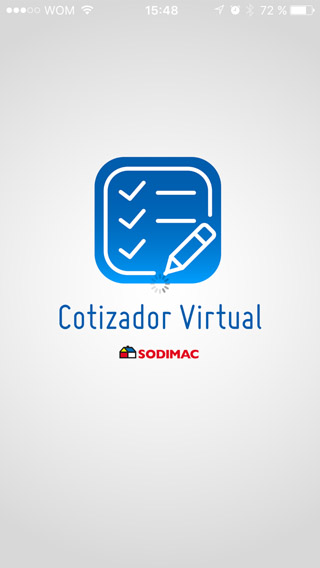
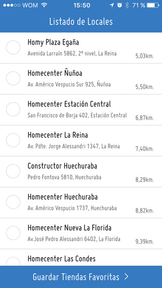
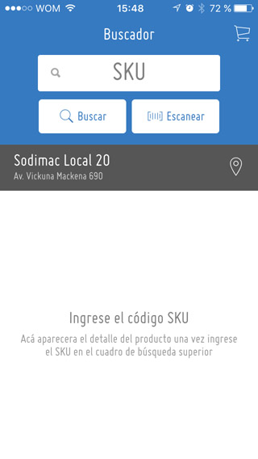
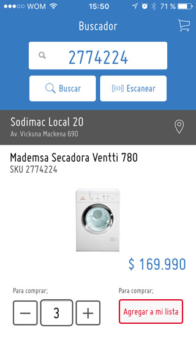
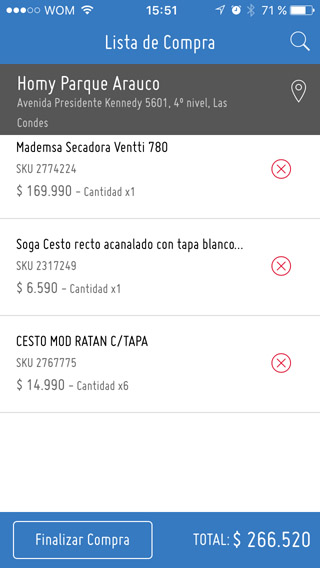

# Cotizador Virtual - Mobile Application

- Mobile Application (Ionic + Gale + Cordova)
- API (Guía Maestra)


## Resources 

- [API](https://bitbucket.org/personal_net/guiamaestra-api)
- [Angular Gale Doc's](http://angular-gale.azurewebsites.net/)
- [Framework API](http://gale.azurewebsites.net/)

## Get Started

### Get dependencies

```sh
# bash
npm install				# restore npm packages
ionic state restore		# restore ionic plugin's
bower install			# restore bower libraries
```

### Mount development server

```sh
# bash
ionic serve -d			# Mount web server without [livereload]
```

### Build for target device's

```sh
# bash
ionic build	ios			# build for ios (only for mac)
ionic build	android		# build for android
```

## Screenshots





